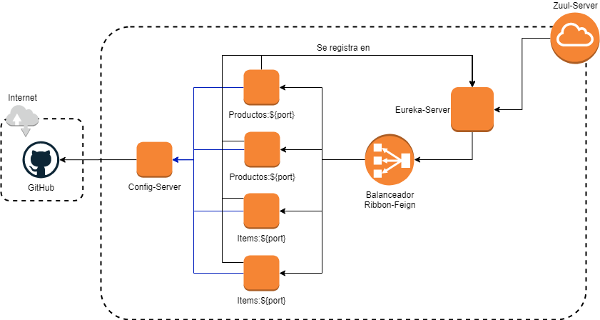

# Spring-boot-and-cloud
Repositorio en el cual se dara a conocer un grupo de proyectos basado en Microservicios, los cuales nos permitiran configurar un ambiente de alta disponibilidad, mediante Balanceo de Carga, Api Gateway, Seguridad, entre otras funciones.

Este repositorio sera le encargado de almacenar los archivos de configuración **properties** los cuales son utilizados en el servicio de configuración

## Imagen de la Arquitectura

  

En función del crecimiento del proyecto se va actualizando la imagen.
